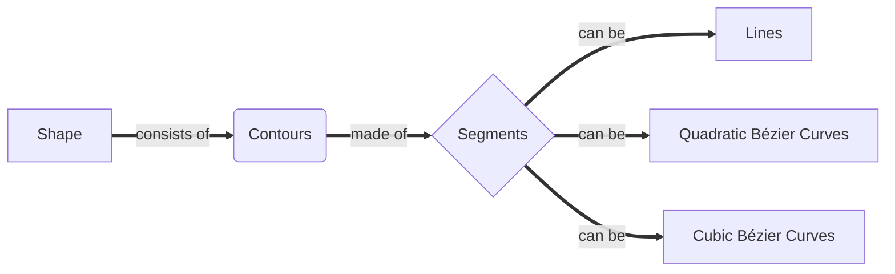

# Signed distance generator :gear:

In this `README`, I will explain how the algorithm works and propose possible improvements.

One of the project's most complex sub-algorithms is the *correction of contour overlaps*. It performs for each texture's texel, which heavily affects the performance. I'll specifically focus on this part in the explanation because it is very error-prone.

## The Algorithm

First, it is important to note that this algorithm is divided into five subparts:

- **Parse shape's instructions**
- **Check for intersections and store intersection data**
- **Generate the distance fields**
- ***Overlap Correction***
- **Convert distance fields to image data**

### Parsing shape's instructions && Checking for intersections and storing intersection data

The glyph shape instructions are parsed and stored in memory for later use in the first part of the algorithm. *Glyph's shape* is constructed from **multiple segments** (*lines*, *quadratic Bezier curves*, *cubic Bezier curves*), which are grouped into closed **contours**.

Instructions for glyph's shape are:

- **start_at** - opens a new contour at the specified starting point

- **line_to** - draws a line from the last point to a specified point

- **quad_to** - draws a *Quadratic Bézier Curve* from the last point to a specified point with one control point

- **curve_to** - draws a *Cubic Bézier Curve* from the last point to a specified point with two control points

- **close** - indicates that there are no further instructions for the current contour and a new one can be opened

