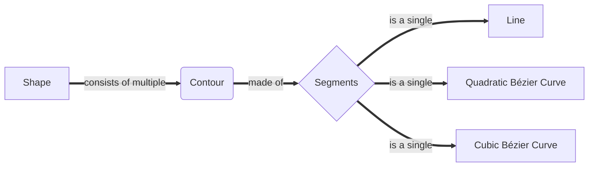
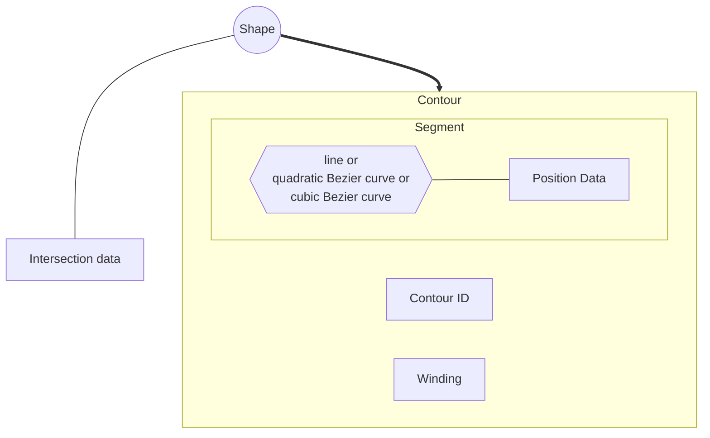

# Signed distance generator :gear:

> **outdated doc - WIP**

In this `README`, I will explain how the algorithm for generating *signed distances* works and propose possible improvements.

One of the more complex sub-algorithms in this crate is the *correction of contour overlaps*. It performs after parsing the glyph shape and after determining if the correction is needed.

## **The Algorithm**

First, it is essential to note that this algorithm is divided into four stages:

**Stage 1:**

- **Parse shape's instructions**
- **Check for intersections and store intersection data**

**Stage 2:**

- ***Overlap correction***

**Stage 3:**

- **Generate the *distance fields***
- **Find the shortest *distance***

**Stage 4:**

- **Convert distance fields to bitmap/image data**

## `Parsing shape's instructions` && `Checking for intersections and storing intersection data`

The glyph shape instructions are parsed and stored in memory for later use in the first part of the algorithm. *Glyph's shape* is constructed from **multiple segments** (*lines*, *quadratic Bezier curves*, *cubic Bezier curves*), which are grouped into closed **contours**.

After the parsing, tests for finding intersections are run, and the results are stored. In particular, for the shape, each contour is tested against another contour to find intersection points.

Instructions for glyph's shape are:

- **start_at** - opens a new contour at the specified starting point

- **line_to** - draws a line from the last point to a specified end point

- **quad_to** - draws a *Quadratic Bézier Curve* from the last point to a specified end point with one control point

- **curve_to** - draws a *Cubic Bézier Curve* from the last point to a specified end point with two control points (:warning:**Warning**: *not yet supported*)

- **close** - indicates that there are no further instructions for the current contour, and a new one can be opened

In the *code*, there is the `Shape` object, the `Contour` object and the `Segment` object, which can represent a `line` or a `quadratic Bezier curve` or a `cubic Bezier curve`.

### **Object data**

Now after clarifying from what components a shape is made of, the following is a clearer view of data which every object holds. Simply said, *Shape* holds *Contour data* which holds *Segment data*.

- **Intersection data** - contains all intersection points between contours with *Contour ID* being stored instead; has stored contours which surround other contours with the same winding

- **Winding** - represents a *boolean* value where `true` value means that the contour is additive (clockwise) and `false` value means that the contour is subtractive (counterclockwise)

- **Contour ID** - a unique ID number which is used in intersections

- **Position Data** - position coordinates of a line or a quadratic Bezier curve or a cubic Bezier curve

### **Intersection testing**

To find intersections, each contour's segment is tested against the other contour's segment and the result is stored. For example, finding intersection points between two lines (*linear functions*) is easily achieved by equalization of their functions.

Linear function example:

$$
f(t) = P_0 + t(P_1 - P_0)
$$

So the equalization of functions, for lines $L_1(t_1) = A + t_1(B - A)$ and $L_2(t_2) = C + t_2(D - C)$, would look like:    

$$
A_{xy} + t_1(B_{xy} - A_{xy}) = C_{xy} + t_2(D_{xy} - C_{xy})
$$

or:

$$
A_x + t_1 (B_x - A_x) = C_x + t_2 (D_x - C_x)
$$

$$
A_y + t_1 (B_y - A_y) = C_y + t_2 (D_y - C_y)
$$

Finally, we'd easily extract $t_1$ and $t_2$, include each in the opposite function and get the correct expression for each.

Including $t_1$ in the equation for the first line returns the intersection point. Since these lines go from $P_0$ to $P_1$, variable $t$ has a condition $t \in [0, 1]$, so $t_1$ and $t_2$ should be checked if they exceed the bounds. If they don't, then the lines intersect.

> :warning::warning::warning: **IMPORTANT:** For testing quadratic and cubic curves against each other , there doesn't exist any numerical solution (as far as I know), so the testing would implement the logic of creating *sub curves* and testing their covered area. 
> 
> Since cubic curves aren't supported yet, the only problem, for now, is quadratic - quadratic curve intersection.

## *`Overlapping correction`*

## `Generating distance fields` && `Finding the shortest distance`

After storing shape and intersection data, the first stage follows using the actual data - *generating distance fields*. 

*What is a [distance field](https://prideout.net/blog/distance_fields/)?*

You can either find out by clicking the provided hyperlink or by reading this short explanation:

> In this case, *signed distance* represents a distance between a point and some shape on an image. In particular, the signed distance for each image texel represents a distance to the closest point on the shape's edge. If the pixel is placed inside the shape, for example, the letter 'I', it would have a positive distance to the shape's closest edge. Otherwise, if the pixel is placed outside the shape, it would have a negative distance to its nearest edge.

To calculate the distance field for one texel or find the shortest distance to the shape's edge, one should calculate the distance between each shape segment and the texel, compare them and find the shortest one.

Calculating distance between a segment, for example a line or a quadratic curve, and a texel can be achieved numerically by finding the difference between the function and the texel position. Achieving the distance is much better explained in [this](https://github.com/Chlumsky/msdfgen/files/3050967/thesis.pdf) document (*Chapter 2*) written by *Chlumsky*, the creator of `msdfgen`.

Calculating distance between a cubic curve segment and a texel can't be achieved numerically because it requires solving a function of the fifth degree (*or can it? I am not sure, yet.*).

---